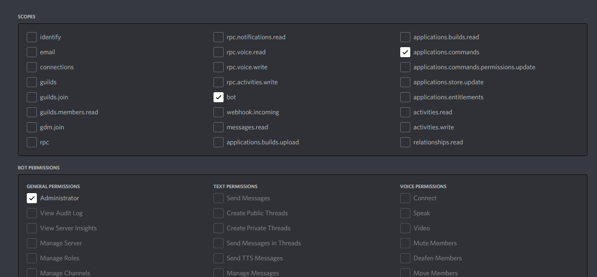

# Discord Poll Bot

This Bot was designed to create easy understandable polls with nice UI for Discord servers.
Based on [u/Feeeeddmmmeee's](https://www.reddit.com/user/Feeeeddmmmeee) ([GitHub](https://github.com/Feeeeddmmmeee)) suggestion for Discord polls.

*Note: This bot is not perfect and is full of bugs... So please report issues on GitHub. If you need a presentation of the bot write me on Discord (ShadowLp174#2717)*

## Installation

<!--- **Important: This is not up-to-date and should be changed in the future** -->

1. Clone the repository using git from the following url: ```https://github.com/ShadowLp174/poll-bot.git```
2. Create a new Discord application as described [here]("https://discordjs.guide/preparations/setting-up-a-bot-application.html#creating-your-bot")
3. Add the bot to your server. **IMPORTANT**: When creating the invite link, make sure to give the bot permission to register application commands! See [image](#images)
4. Replace `clientId` and `token` in the config.json file with your own tokens.
5. Get the server id of the server you want to use your bot in. And add it to the config.json like described [here](#setting-guildID)
6. Run `node command-deployer.js`
7. After it finished run `node .` - The bot should be online now!
8. You're done!

### Setting GuildID

* First you need to get the ID of your server because only this way the slash-commands can be registered instantly.
* To do this right-click the icon of your server and select `Copy ID`. If you can't see this option you'll have to go to Discord settings and turn on `Developer Mode` on the `Advanced` page.
* Now, open the config.json file and set your ID like this: `["<yourID>"]` (It **has to be** encapsulated in Quotation marks)
* If you have more than one server, you'll need to add all the ids seperated by commas: `["<ID1>", "<ID2>", "<ID3>"]`

#### Images

The needed authorization scopes for the invite link:

